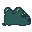
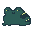

# Birthday PARTY — жабячий односторінковий сайт

Одна сторінка `index.html`, без збірки і без залежностей. Відкривається подвійним
кліком у браузері. Уся сцена масштабується цілком, тому на телефоні видно все
одразу, без прокрутки.

```
frog-bday/
├─ index.html   ← вся сторінка: розмітка + CSS в одному файлі
├─ img/         ← сюди кладеш свій піксель-арт
└─ README.md
```

---

## 1. Що малювати і в якому розмірі

| Файл | Розмір полотна | Що на ньому |
|---|---|---|
| `frog-1.png`, `frog-2.png` | 32×32 ✅ готово | жаба, два кадри |
| `pad-gift-1.png`, `pad-gift-2.png` | 32×32 ✅ готово | латаття з подарунком 🎁 |
| `pad-gift-hover.png` | 32×32 ✅ готово | подарунок при наведенні / натисканні (3-й кадр) |
| `pad-map-1.png`, `pad-map-2.png` | 32×32 ✅ готово | латаття з мапою 🗺️ |
| `pad-info-1.png`, `pad-info-2.png` | 32×32 ✅ готово | латаття зі знаком оклику ❗ |
| `title-birthday-1.png`, `title-birthday-2.png` | 40×14 ✅ готово | слово «Birthday» у заголовку |
| `title-party-1.png`, `title-party-2.png` | 28×14 ✅ готово | слово «Party» у заголовку |
| `pad.png` | 22×22 | порожнє латаття (декор, один кадр) |
| `bg.png` | **180×240** | фон на всю сцену — *необов'язковий, зараз не використовується* |

Фон зараз — просто колір `#1e2029` (`--bg-1`). Якщо колись намалюєш фон
картинкою, поклади її в `img/bg.png` і розкоментуй рядок `background:` з
`url("img/bg.png")` у секції `.stage`.

Фон має бути **прозорий** — інакше навколо спрайтів будуть квадрати.

Розміри — рекомендація, не жорстке правило. Якщо намалюєш інші, картинка
однаково впишеться: код масштабує спрайт під контейнер. Головне — квадратне
полотно, бо контейнери квадратні.

Жаба і латаття з річчю — 32×32. Ширина на сцені: жаба `--frog-w` = 29%,
латаття з річчю `--pad-w` = 21%, порожнє латаття (16×16) `--pad-decor-w` = 12%. Щоб латаття виглядало меншим за
жабу, малюй його дрібніше всередині полотна 32×32, а не зменшуй полотно. Якщо зробити латаття 64×64, його
піксель буде втричі дрібніший за жабин, і виглядатиме неохайно.

### Експорт із Piskel, конкретно

`Export` → вкладка **Zip** → галочку `Split by layers` **зняти** (з нею
експортуються окремі шари, а не готові кадри) → `Download ZIP`. Всередині два
файли `<prefix>_0.png` і `<prefix>_1.png` — це кадр 1 і кадр 2.
`Scale` лишати `1.0x`.

---

## 2. Як експортувати з Piskel

У Piskel панель **Export** дає кілька варіантів — підходить будь-який:

- **PNG → Download frames as ZIP** → окремі PNG на кожен кадр. Це варіант А, найзручніший.
- **GIF** → готова анімована гіфка з обраним FPS. Це варіант Б.
- **PNG → spritesheet** → два кадри в один файл рядком. Це варіант В.
- **.piskel** → робочий файл. **Обов'язково збережи собі** — тільки з нього
  можна буде потім домалювати.

---

## 3. Як вставити свої картинки

У `index.html` кожен спрайт виглядає так:

```html
<div class="sprite" style="--x:50%; --y:52%; --w:var(--frog-w); --speed:var(--anim-frog)">
  <!-- ВАРІАНТ А — два PNG:
  
  
  -->
  <!-- ВАРІАНТ Б — гіфка:
  
  -->
  <span class="ph" data-size="жаба 96×96">🐸</span>
</div>
```

Треба зробити дві речі: **розкоментувати** свій варіант (прибрати `<!--` і `-->`)
і **видалити рядок** `<span class="ph" ...>` — це емодзі-заглушка.

Для **варіанту В** (спрайтшит) рядок з картинкою не потрібен, замість нього
додай класу `sheet` і вкажи файл:

```html
<div class="sprite sheet"
     style="--x:50%; --y:52%; --w:var(--frog-w); --speed:var(--anim-frog);
            background-image:url(img/frog-sheet.png)">
</div>
```

---

## 4. Що ще можна крутити

Блок `НАЛАШТУВАННЯ` на самому початку `index.html`:

- `--anim-frog`, `--anim-pad` — швидкість анімації. Менше число = швидше.
- `--frog-w`, `--pad-w`, `--pad-decor-w` — розміри у % від ширини сцени.
- `--bg-1` — колір фону.

Позиції латаття — `--x` і `--y` прямо в розмітці, у % від сцени
(`--x:0%` — лівий край, `--y:0%` — верх).

**Посилання:** у трьох тегів `<a class="pad sprite" href="#">` заміни `#` на свої
адреси — віш-лист, Google Maps, і сторінку/документ з дрес-кодом.

**Ім'я і дата:** порожній рядок `<p class="subtitle"></p>` — впиши текст між тегами.

---

## 5. Викласти на GitHub Pages

1. Створи на github.com новий репозиторій `frog-bday` (публічний — Pages
   безкоштовно працює тільки з публічними).
2. У цій папці:

   ```bash
   git init
   git add .
   git commit -m "жабячий сайт до дня народження"
   git branch -M main
   git remote add origin https://github.com/<твій-нік>/frog-bday.git
   git push -u origin main
   ```

3. У репозиторії: **Settings → Pages → Source: Deploy from a branch →
   Branch: `main`, folder: `/ (root)` → Save**.
4. Через хвилину-дві сайт буде на `https://<твій-нік>.github.io/frog-bday/`.

Далі кожне оновлення — просто:

```bash
git add .
git commit -m "додала жабу"
git push
```

Посилання лишається те саме.

### Про приватність

Сайт публічний — будь-хто з посиланням його побачить. Тому:

- точну адресу вечірки **не пиши текстом на сторінці**, давай посилання на карту;
- у файлі вже стоїть `<meta name="robots" content="noindex, nofollow">`, це
  просить пошуковики не індексувати сторінку.

### Як прибрати сайт після свята

**Settings → Pages → Source: `None`** — і сторінка перестає відкриватись.
Або видалити репозиторій цілком (**Settings → внизу → Delete this repository**).
Врахуй: якщо посилання встигло десь засвітитись, копія могла лишитись у кеші
Google або на web.archive.org.
